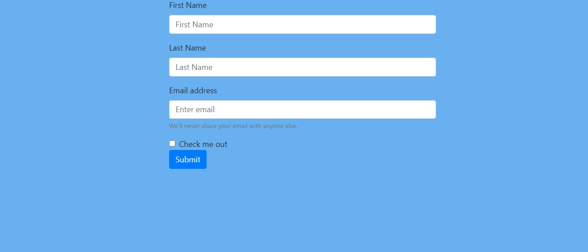

# Newsletter-App-backend

This is the backend of a newsletter app developed using HTML, Bootstrap, Node JS and Express JS for the backend. It uses [MailChimp's API](https://mailchimp.com/) to sign-up a user for the newsletter.



## Tech Stack-
- HTML
- CSS
- Bootstrap
- Node JS
- Express JS

## Environment Setup-

* Drop a :star: on the GitHub repository.
<br/>

* Download and install a code/ text editor.
    - Recommended-
        - [Download VS Code](https://code.visualstudio.com/download)
        - [Download Atom](https://atom.io/)
<br/>

* Download [Node Js and npm(Node package manager)](https://nodejs.org/en/) (when you download Node, npm also gets installed by default)
<br/>

* Clone the repository by running command
```
git clone https://github.com/ <your user-name> /Newsletter-App-backend.git
```
in your git bash.
<br/>

* Run command `cd Newsletter-App-backend`.
<br/>

* Run this command to install all dependencies for the project.
```
npm install
```
<br/>

* Run this command to start the project on local host 3000.
```
npm start
```
<br/>

* Open link to view the website in your browser window if it doesn't open automatically.
```
http://localhost:3000/
```
<br/>

* Now you are all set to use this project.

